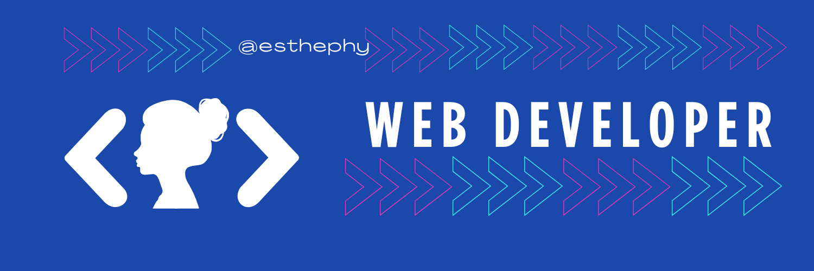

<h1 align="center">Hi, I am <a href="https://esthephy.github.io/Portafolio/#inicio">Estephany Surco</a> 👋</h1>

## About me

- 💻 Frontend and backend web developer
- 📱 Supporting mobile systems with Flutter and REST APIs
- 🧠 Passionate about technology with social impact
- 👩‍💼 Project manager with an agile (Scrum) approach
- 🚀 I create digital solutions to improve real-world processes
 

### ⚙️ &nbsp;GitHub Analytics

